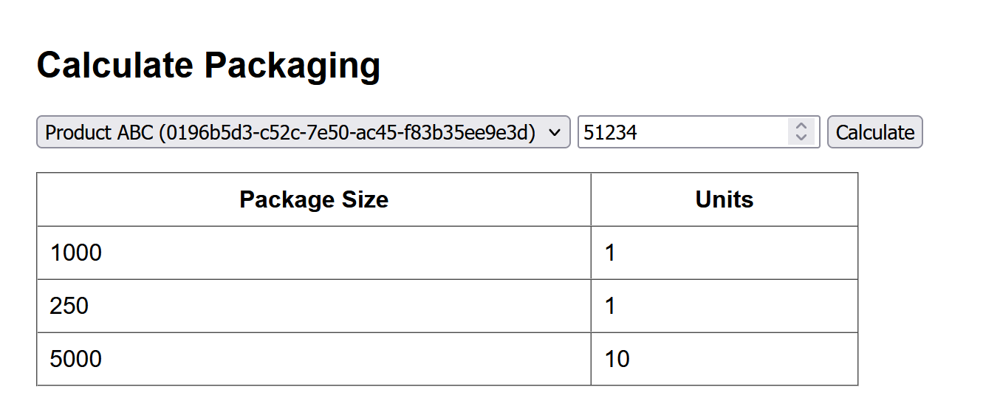
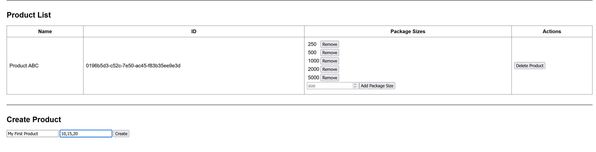
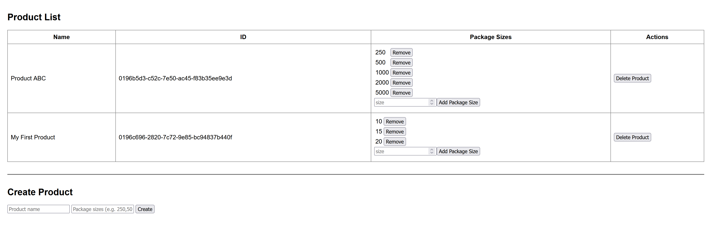
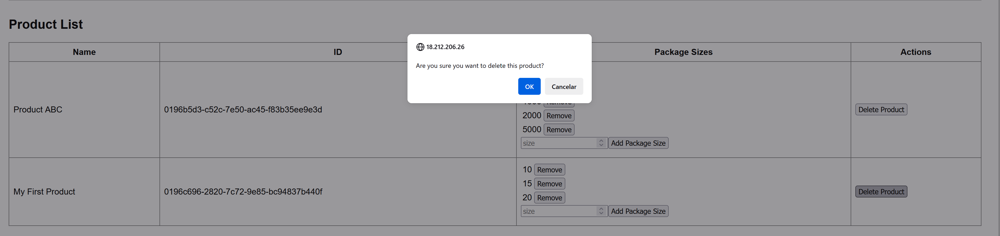

## How to build
#### Requirements
- Go and Node should be installed locally. If go is not installed, there is a Dockerfile available under `/build`.
#### Backend 
- in a shell: change the working directory to `/backend` 
- run `make` . That'll start the application and you'll see a log entry similar to `2025/09/32 21:37:04 server started. listening on port :8080` 
#### Frontend
- in a shell: change the working directory to `/backend/product-app`
- run `npm start`. It might take some seconds to minutes but eventually the app will be available in a browser via `localhost:3000`

## How to use
- If you want to see the backend API, visit the page `localhost:8080/docs`. 
- Access `http://ec2-18-212-206-26.compute-1.amazonaws.com/` and use the UI.

#### Calculate Number of Packages

#### Create a New Product

#### Delete a Product

## Notes on implementation
- Using SQLite for ease of deployment. In production, this could be a SQL/NoSQL database with persistence, such as PostgreSQL or DynamoDB.
- Using github.com/rubenv/sql-migrate for setting the database scheme and seed test examples.
- List products endpoint should be paginated.   
- Split the backend in 3 different layers to keep domains segregated: server, service (actual business logic) and storage. models package is common to the logical layers and makes mapping easier.
- REST API can be split into 2: CRUD for products and specific add/remove package size to product and calculate package units. API docs can be consulted in: TODO 
- Calculation Algorithm was implemented using a dynamic programming logic that looks for the least amount of packages to be sent and then looks for the solution that ships less units, ie. smaller package sizes. 

## TODOS 
- tests